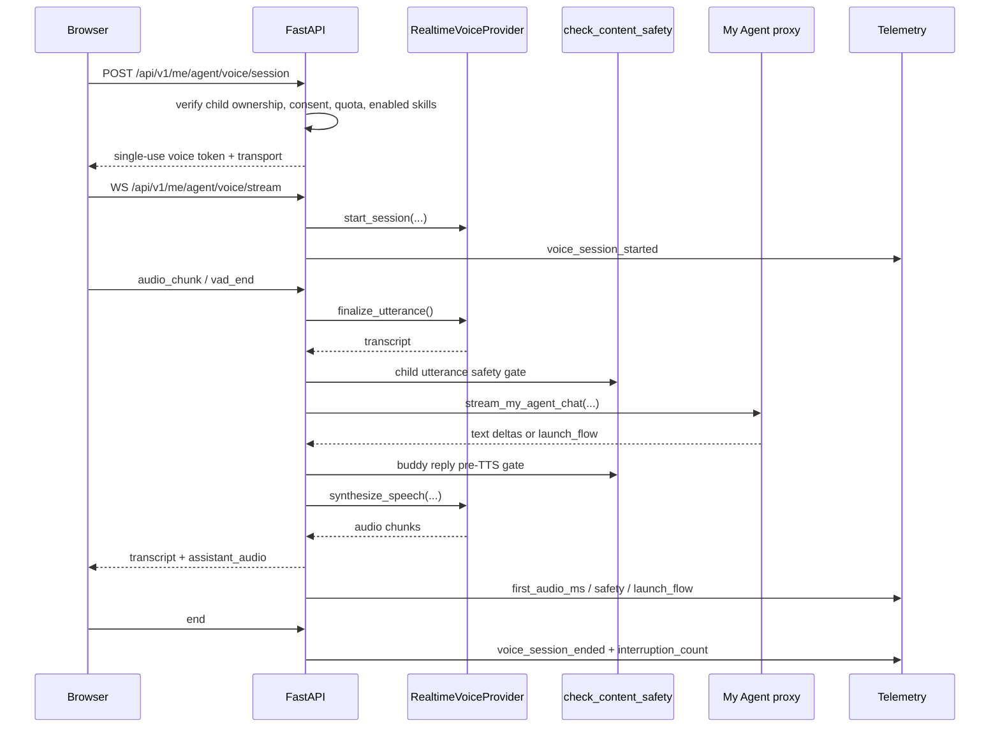

# Talk to Buddy Architecture

Talk to Buddy is the realtime voice surface for My Agent. It adds speech input
and speech output to the existing buddy chat without changing the underlying
My Agent proxy, memory, safety, or launch-flow contracts.

## Request Flow

## Provider Abstraction

The broker depends on `RealtimeVoiceProvider` in
`backend/src/services/realtime_voice_service.py`. Provider selection is process
level and controlled by `REALTIME_VOICE_PROVIDER`:

| Value | Provider | Notes |
|---|---|---|
| `mock` | `MockRealtimeVoiceProvider` | Deterministic local/test path. Always returns the same transcript. |
| `hybrid` | `HybridRealtimeVoiceProvider` | Cascaded STT + Claude + TTS fallback. Degrades internally when optional provider keys are absent. |
| `openai` | `OpenAIRealtimeProvider` | Primary realtime path when `OPENAI_API_KEY` exists. Falls back to hybrid if the key is missing. |
| unset | `MockRealtimeVoiceProvider` | Safe dev default. |

The browser uses the same session endpoint for every provider. The backend
chooses `transport="webrtc"` only when the caller opts in and the selected
provider can mint a browser-direct OpenAI realtime secret; otherwise the WS
broker remains the universal transport.

## Safety Pipeline

Safety is fail-closed at three points:

1. Token mint verifies child ownership, microphone consent, voice-conversation
   consent, rolling quota, and enabled-skill eligibility before a session can
   start.
2. Every finalized child utterance runs through `check_content_safety` before it
   reaches the My Agent proxy.
3. Every buddy reply runs through the normal reply safety path before text is
   converted to speech. If the safety MCP tool or review specialist fails, the
   reply is replaced by the age-safe fallback.

Raw audio bytes are transient. The browser streams chunks to the broker, the
broker forwards them to the selected provider, and no route writes raw audio to
disk. Durable history is transcript-only through `agent_chat_messages` with
voice modality fields.

## Telemetry Surface

`backend/src/services/voice_telemetry.py` emits bounded structured events only.
Do not put child speech, buddy text, raw audio, or free-form prompt content in
these records.

| Event | Purpose |
|---|---|
| `voice_session_started` | Engagement by age group, provider, and buddy persona. |
| `voice_session_ended` | Duration and ended reason, including timeout, quota, disconnect, and normal end. |
| `voice_session_safety_rejection` | Counts rejected utterance/reply turns by bounded category. |
| `voice_session_launch_flow_emitted` | Measures voice-driven handoff into creation flows. |
| `voice_session_first_audio_ms` | Time to first audible buddy response for p50/p95 latency. |
| `voice_session_interruption_count` | Barge-in tuning signal, emitted once at session close. |

The launch checklist for production provider rollout lives in
`docs/guides/voice-launch-prerequisites.md`.
