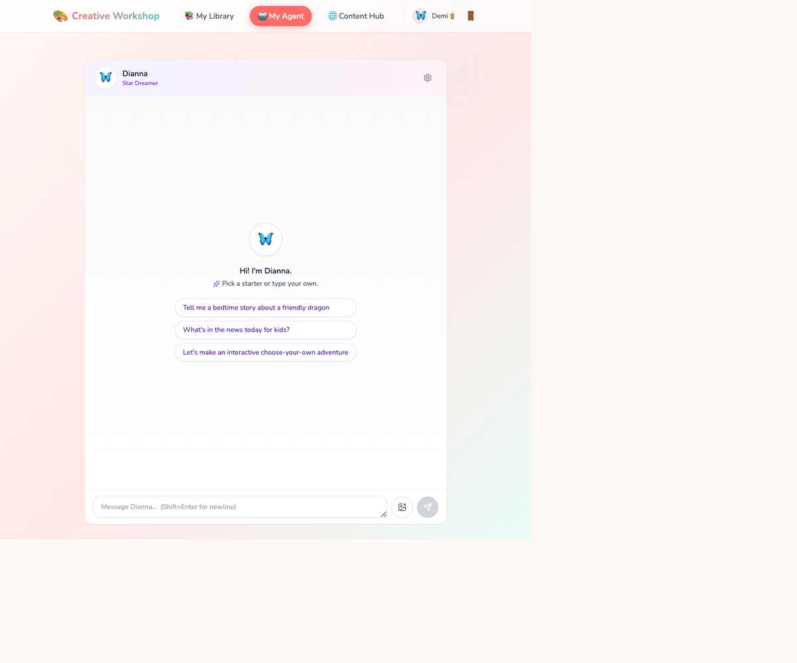

<!-- _class: title -->

# Kids Creative Workshop

## An *agentic* app for kids — built on Claude Agent SDK.

 

<small>5-minute pitch · Single agent → agent team · 2026</small>

<!--
SPEAKER NOTES (slide 1 — Title)
Open warm and slow. Read the title, pause, read the subtitle slowly.
Say: "I want to start with a moment." Then click forward.
-->

---

<!-- _class: title -->

# A 5-year-old hands you a crayon drawing.

 

# *What if it became a story?*

 

# *In her character. Her voice. Her world.*

<!--
SPEAKER NOTES (slide 2 — The moment)
Pause 3 seconds after each line. Resist the urge to rush.
This is the emotional anchor of the whole pitch.
Everything technical that follows is in service of THIS moment.
-->

---

## Today's AI fails kids in two opposite ways

|  | ChatGPT | Image generators |
|---|---|---|
| **Treats kid as** | input | object to replace |
| **Their drawing** | ignored | erased |
| **Their character** | forgotten | redesigned |
| **Their voice** | overridden | gone |

# Existing AI **extracts**. We **collaborate**.

<!--
SPEAKER NOTES (slide 3 — OPTIONAL, drop for 3-min)
Quick. Two columns. Don't dwell — the contrast does the work.
Land on the bold line. Then move.
-->

---

# Meet **My Agent**

A personal AI buddy the child **names**, **customizes**, and **grows with**.

- **Recognizes** their recurring characters (Lightning the puppy is back)
- **Routes** their requests to the right specialist
- **Protects** every reply with a safety subagent before delivery
- **Shares** under the buddy's name — zero PII, COPPA by construction

<small>One chat surface. Four specialists. One non-negotiable safety gate.</small>

<!--
SPEAKER NOTES (slide 4 — Product intro)
The product IS the agentic architecture wrapped in a buddy persona.
Don't read the bullets — narrate over them.
"Lightning the puppy" is sticky; use the name.
-->

---

## Foundation — *one agent, four primitives*

Built on **Claude Agent SDK**:

  

    🧭
    Prompt design
    Markdown prompts versioned in git
  

  

    🔧
    Tools
    Custom MCP servers: vision · vector · safety · TTS
  

  

    🔌
    MCP
    Tool calls as first-class affordances — not string-parsing
  

  

    🛠️
    Skills
    <code>@tool</code> decorators · per-agent skill gating
  

<small>One agent. No orchestrator. Just an LLM with the right scaffolding.</small>

<!--
SPEAKER NOTES (slide 5 — Single-agent foundation)
This is "how we started simple." The pitch arc is EVOLUTION — judges love seeing a team that started right-sized and grew when needed.
Quick walk: Prompt design (versioned in git, not in code strings), Tools (MCP servers we wrote ourselves), MCP (the standard that made tool-calling actually clean), Skills (we gate features per child-agent via enabled_skills — that's the kid-safety layer at the affordance level).
-->

---

## Three properties — kids feel them *immediately*

| 🌊 **Interactive** | 💡 **Proactive** | 🧠 **Persistent** |
|---|---|---|
| Streaming SSE — story writes itself, token by token | Recommends next moves · recalls recurring characters | Memory across sessions — same buddy for life |
| *"It's writing right now!"* | *"Lightning the puppy is back!"* | *"My buddy remembers."* |

<small>One agent. Three properties. **Already a real product.**</small>

<!--
SPEAKER NOTES (slide 6 — Three properties)
This is the "what good agentic feels like" slide. Each property has a concrete kid moment under it.
Interactive = streaming SSE; not loading spinners, the story writes itself live.
Proactive = the buddy suggests, recalls. NOT a Q&A bot.
Persistent = memory across sessions. Lightning the puppy you drew last week appears in this week's Kids Daily as the guest anchor.
End with the line "already a real product" — that's the pivot before showing why one agent wasn't enough.
-->

---

<!-- _backgroundColor: "#0F172A" -->
<!-- _color: "#F8FAFC" -->
<!-- _class: dark -->

## Extending to a team — *responsive + dynamic*

One agent hit a ceiling. Branching stories, news podcasts, per-reply safety — each needed its own expertise. We extended to an **agent team** — still on Claude Agent SDK.

**Unlocks**: 🎯 **responsive** · 🎨 **dynamic** · ➕ **A2A extensible**

<!--
SPEAKER NOTES (slide 7 — Multi-agent extension, the CENTERPIECE)
Walk the diagram top to bottom. 30-40 seconds.

1. "We extended — same SDK, new shape."
2. "The proxy ORCHESTRATES — it routes the child's intent to the right specialist."
3. "Four specialists, each with their own prompt, tools, and skill set."
4. "Every reply passes through safety_review — that subagent is the non-negotiable gate."
5. "And underneath everything, SHARED CONTEXT — persona, child_id, recurring characters — flows to every agent. So Lightning the puppy is the same dog in the story AS in the podcast."
6. "Two more properties unlocked: responsive (right specialist in milliseconds) and dynamic (different experience per turn). And it's A2A extensible — new specialists plug in by registering one AgentDefinition."

REBUILD THIS IN KEYNOTE with real shapes after import. The ASCII version is a placeholder.
-->

---

## Decisions, not defaults — *every primitive earned its place*

| Decision | Alternative we rejected | What we chose | Why |
|---|---|---|---|
| **Prompts** | Python f-strings inline in code | Markdown files in `backend/src/prompts/` — `story-generation.md`, `age-adapter.md`, `interactive-story.md` | Versioned · code-reviewable · age-stratified per file |
| **Tools** | Direct API calls in agent loops | Custom MCP servers · typed JSON envelopes · `.handler` calling convention | Composable · testable · independently versionable |
| **Skills** | Hardcoded behaviors per agent class | `enabled_skills` field on `AgentDefinition` · `_enabled(agent, skill)` runs server-side | Per-age gating · A2A plug-in · single registration |
| **Multi-agent** | Bigger prompt + conditional branching | Proxy + 4 subagents + shared context bus | Specialty isolation · safety_review on **every** reply · responsive routing |

**Vocabulary** — *agent* · *subagent* · *team* · *orchestrator* — each role is precise. See appendix.

<!--
SPEAKER NOTES (slide 8 — Design decisions, NEW)
This is the "we made decisions, not defaults" slide.

Walk it row-by-row, ~7 seconds per row:
1. Prompts: "We could have inlined prompts as Python strings. We chose markdown files in git — versioned, code-reviewable, age-stratified per file."
2. Tools: "We could have called the API directly inside agent code. We chose custom MCP servers with typed envelopes — composable, testable, and the .handler convention lets us debug them."
3. Skills: "We could have hardcoded behaviors. We chose enabled_skills as a field on AgentDefinition — per-age gating, A2A extensible, server-side gate."
4. Multi-agent: "We could have used a bigger system prompt with branching. We chose a proxy + 4 subagents — each specialty isolated, safety subagent on EVERY reply, responsive routing."

Close: "We didn't adopt defaults. Each row is a trade-off we made deliberately."

DEFAULT-CUT FOR 5-MIN — keep for 6-min slot or technical-heavy judging panels.
-->

---

## Where we innovate — *three layers, six bets*

| 🤖 **Agentic stack** | 🛡️ **Safety architecture** | 🌟 **Kid experience** |
|---|---|---|
| **Multi-agent + shared state** on Claude Agent SDK | **Per-reply programmatic safety** — age-aware (0.90 / 0.85) | **Character continuity** across image · story · podcast · share |
| **A2A extensible** — one `AgentDefinition` to add a specialist | **COPPA at the schema level** — the unsafe JOIN *can't be expressed* | **One buddy, N specialists, one identity** |

<small>Most kid-AI products ship **one** of these. We ship **all six**.</small>

<!--
SPEAKER NOTES (slide 8 — Innovation moats, NEW)
This is the "we are not a wrapper" slide. Read each cell as a defensible claim, NOT a feature list.

Walk it column-by-column, ~7 seconds per cell:
- Agentic stack: "Multi-agent with shared state on the SDK — A2A extensible, so new specialists plug in by registering a single AgentDefinition."
- Safety architecture: "Per-reply programmatic safety with age-aware thresholds — and COPPA enforced AT THE SCHEMA LEVEL. The unsafe JOIN can't even be expressed."
- Kid experience: "Character continuity across surfaces — same Lightning the puppy from her drawing shows up in her interactive story, her podcast, her community feed. One buddy, many specialists, one identity."

Land hard on: "Most ship ONE of these. We ship ALL SIX." Pause. Then move.
-->

---

## What kids actually do — *one chat, four specialists*

The buddy's three starter prompts map to three specialists: **bedtime story** → `image_story` · **news for kids** → `kids_daily` · **choose-your-own** → `interactive_story`. One chat. One persona. The orchestrator dispatches.

> 🎬 **Live demo here — 15 seconds.** Open the app. Draw → buddy generates a story with their character.

<!--
SPEAKER NOTES (slide 9 — Product proof + demo beat)
This is the PROOF slide. Point at the buddy's chat in the hero screenshot.
The 3 starter prompts in the screenshot map DIRECTLY to 3 specialists — that's the user-facing surface of the multi-agent diagram from slide 7. Make this point explicitly:
"You can see the buddy — Dianna in this case — offering three starter prompts. Each one routes to a different specialist underneath. Tell me a story → image_story. What's in the news → kids_daily. Choose your own adventure → interactive_story. One chat surface, the multi-agent team behind it."

DEMO BEAT (optional but high-impact):
If you have 15 seconds of buffer, open the actual app and run ONE flow live — preferably drawing-to-story. Don't try to demo all four specialists; pick one and let it land. If you don't have live demo capability, replace this slide's demo box with a 10-second screen recording (drop it into Keynote as a video).
-->

---

## Where we are

| Milestone | Status |
|---|---|
| **Phase 1** MVP — Single agent + image-to-story + safety + TTS | ✅ **92/92** shipped |
| **Phase 2** Multi-agent team + memory + news + community | ✅ **180/180** shipped |
| **Phase 3** Video · parent dashboard · gamification | 🔜 In design |

 

**Engineering rigor:** 700+ contract tests · per-reply programmatic safety (age-aware) · silent safety-bypass caught + fixed in 1 day · merge-train of 7 PRs landed last week

<small>*Add real numbers in Keynote: pilot users · sessions/week · feedback quotes.*</small>

<!--
SPEAKER NOTES (slide 9 — Traction)
The "272 stories shipped" is execution proof. So is the silent-safety-bypass-fixed-in-1-day story (that's the kind of receipt judges remember).
If you have pilot users, replace the italic line. Even closed-beta numbers are credibility.
-->

---

## Failures we owned — *receipts, not theater*

| What we tried | How it broke | What we did about it |
|---|---|---|
| **SDK subprocess** for image-to-story | Railway exit -9 · OOM kills under load | Ported all 3 generation agents to direct API · ~50% memory drop |
| **`await check_content_safety({...})`** | `SdkMcpTool` wrapper not callable · `TypeError` swallowed → default 0.9 score | Caught + fixed in 24h · `.handler` calling convention · 3 agents, 1 PR |
| **Single agent + safety prompt** | Model occasionally produced unsafe replies | Per-reply programmatic safety subagent · age-aware · fail-closed retry |

<small>Most pitches hide bugs. We name ours — that's how you know we *actually* run safety like infrastructure.</small>

<!--
SPEAKER NOTES (slide 10 — Failures we owned, NEW)
Counter-intuitive slide. Most pitches show only wins. This one builds trust by showing you look at your own AI critically.

Land each row in ~9 seconds:
1. "We tried the SDK subprocess for image-to-story — Railway killed it. So we ported to direct API and got half the memory back."
2. "We tried calling check_content_safety directly — the wrapper isn't callable, the TypeError was swallowed, every story shipped with a default 0.9 score. We caught it ourselves and fixed it in a day."
3. "We tried single agent + safety prompt — not good enough. So we built per-reply programmatic safety with retry."

Punchline: "Most pitches hide bugs. We name ours. That's how you know we actually run safety like infrastructure."

If your slot is tight, this is the FIRST slide to cut. But judges who see it remember it.
-->

---

<!-- _class: title -->

# Why this matters

- **Agentic from day one** — not a wrapper, not a prompt. Real SDK, real tools, real orchestration.
- **272 stories shipped** across 3 milestones — *execution proof*
- **Programmatic safety on every reply** — non-negotiable, code-enforced, not vibes
- **Community that protects child PII at the schema level** — COPPA by construction
- **A buddy that grows with the child** — character continuity across image, story, podcast, share

 

# *AI that grows up* ***with*** *kids — safely.*

<!--
SPEAKER NOTES (slide 11 — Closing bookend)
Closing mirrors the opening ("agentic for kids" → "grows up WITH kids").
Read the achievements briskly. PAUSE. Then deliver the closing line slowly, holding eye contact.
Then: "Happy to take questions."
-->

---

## Appendix — technical deep-dive *(backup for Q&A)*

| Topic | One-line answer |
|---|---|
| **Agent** | `AgentDefinition(model="haiku", system_prompt=..., tools=[...], enabled_skills=[...])` — one specialist w/ a curated capability set |
| **Subagent** | An agent registered under the proxy's `agents=` dict · invoked via the SDK's `Agent` tool delegation |
| **Agent team** | Proxy + 4 subagents (image_story · interactive_story · kids_daily · audio_narration) + safety_review · all share the context bus |
| **Orchestrator** | The proxy ("My Agent") — routes intent · composes specialist outputs · runs safety_review on every reply |
| **Why this shape** | Bigger prompt → quality degrades w/ specialty count · prompt chaining → no shared state · agent team → shared context + parallel specialty + A2A extensibility |
| **SDK** | `claude_agent_sdk` — `ClaudeSDKClient` + `AgentDefinition`s + custom MCP servers via `@tool` |
| **Intent routing** | `_classify_intent(utterance, age)` — deterministic keyword rules + LLM disambiguation · age 3-5 vague `"story?"` → image_story by default |
| **Per-reply safety** | `enforce_chat_safety()` after every proxy reply · age-aware threshold · `suggest_content_improvements` retry · `safety_blocked` SSE telemetry on fail |
| **Shared state** | `build_my_agent_context(user_id, child_id)` passes persona + recurring characters to every specialist's system prompt |
| **COPPA pattern** | `hub_posts.agent_name`, `agent_avatar`, `agent_title` — immutable snapshot columns; no read path JOINs `users` |
| **Streaming** | SSE event types: `status` · `progress` · `tool_use` · `tool_result` · `launch_flow` · `safety_blocked` · `result` · `complete` |
| **Testing** | 700+ contract tests · per-MCP-tool + per-agent + per-route contracts · pytest, `pytest-asyncio` |
| **Tech stack** | FastAPI + Pydantic v2 · SQLite (dev) / Postgres + pgvector (prod) · React 18 + TypeScript + Tailwind + TanStack Query |

<small>This slide is hidden by default. Reveal only if a judge probes the architecture.</small>

<!--
SPEAKER NOTES (slide 12 — APPENDIX, hidden by default)
HIDE THIS SLIDE in Keynote during the main presentation (right-click slide thumbnail → Skip Slide).
UNHIDE only if a judge asks a deep technical question during Q&A — then jump to it.
Each row is a one-line answer to a likely follow-up question. Don't read the whole table — jump to the relevant row.
-->
