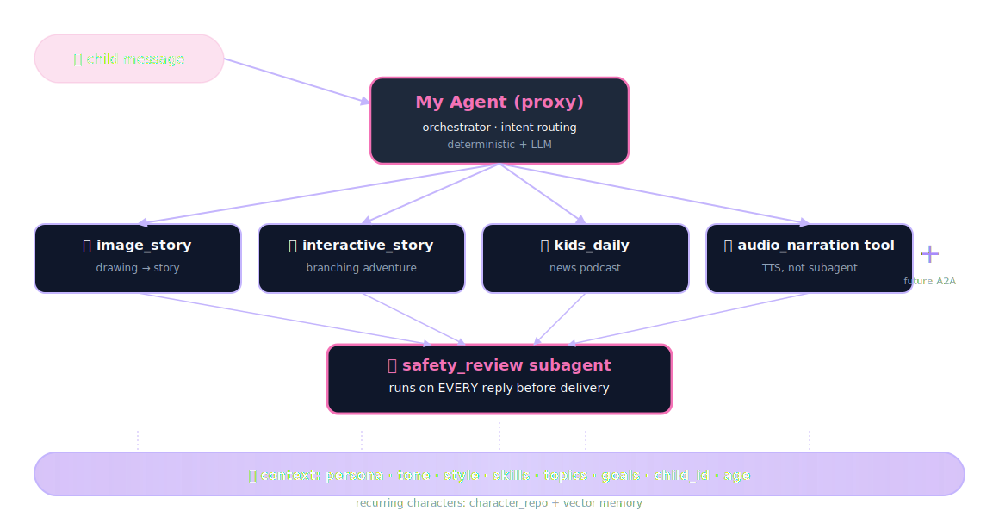
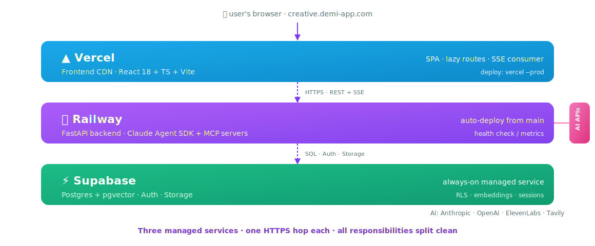
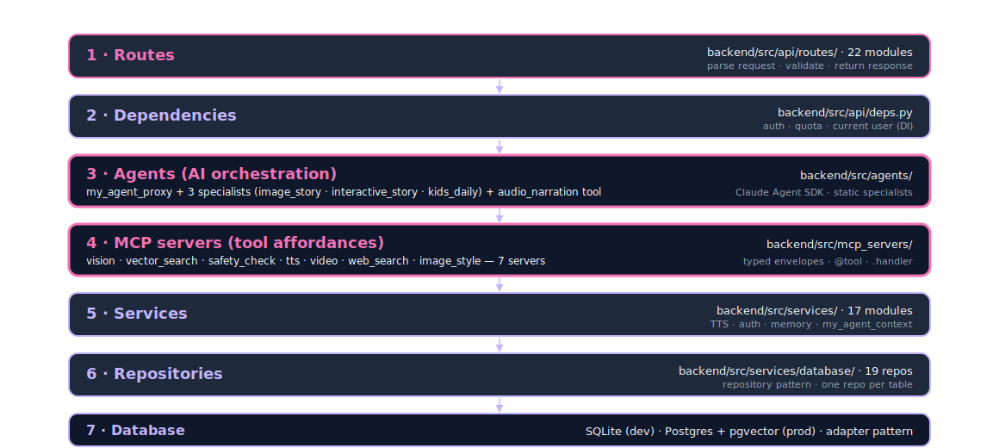
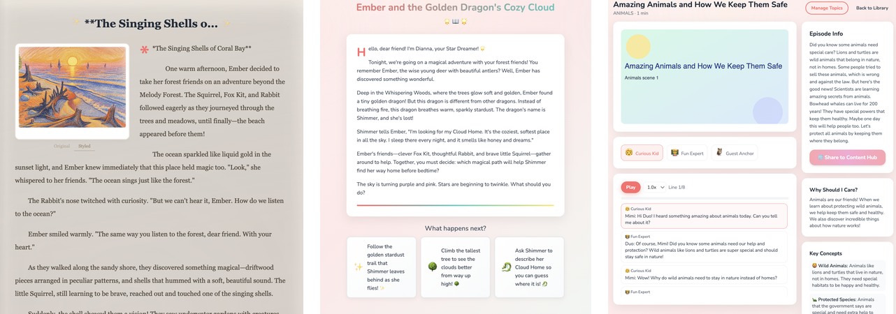
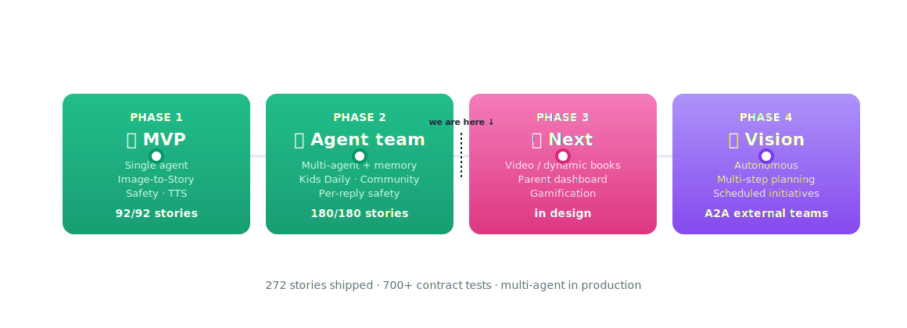

<!-- _class: title -->


# Kids Creative Workshop

## An *agentic* app for kids — built on Claude Agent SDK.

<br>

<small>5-minute pitch · Single agent → agent team · 2026</small>

<!--
🎤 SCRIPT · Slide 1 · Title
⏱ ~8 seconds · 5-min cut: KEEP

"Good [morning/afternoon]. Kids Creative Workshop —
an agentic app for kids, built on Claude Agent SDK.

Let me start with a moment."

🎬 Delivery: Warm and slow. Don't rush the subtitle. Pause, then click.
➡ Transition: pivot directly to the emotional anchor on slide 2.
-->

---

<!-- _class: title -->

# Three moments. One buddy.

<br>

# *Her drawing — becomes a story.*

# *Her character — stars in the next adventure.*

# *Tomorrow's news — arrives as her podcast.*

<!--
🎤 SCRIPT · Slide 2 · Three moments
⏱ ~28 seconds · 5-min cut: KEEP

"Three moments — one buddy.

[2-second pause]

A five-year-old hands her drawing to her buddy.
It becomes a story — in her character, her voice.

[2-second pause]

The same character stars in the next adventure —
her choices, her ending.

[2-second pause]

Tomorrow's news arrives as her podcast —
kid-safe, in her buddy's voice.

[3-second pause]

One buddy. Three kinds of moments. Her world, every time."

🎬 Delivery: SLOW. Three product moments, three deliberate pauses. The cadence is the slide.
➡ Transition: "But today's AI fails her on every one of those moments. Here's how."
-->

---

## Today's AI fails kids on *four* fronts

| 🚫 **Not personalized enough** | 🚫 **Not highly customized** |
|---|---|
| Generic output. No memory of *her* characters, *her* voice, *her* age. | Same prompt, same answer for every child. No buddy identity. No per-child capability set. |

| 🚫 **No suited news for kids** | 🚫 **No long-term persistence** |
|---|---|
| Today's news products are adult-first. No age-aware filter. No narrative voice for kids. | Each session resets. *Lightning the puppy* is forgotten by Monday. |

<small>Existing AI **extracts**. We **collaborate**.</small>

<!--
🎤 SCRIPT · Slide 3 · Four problems
⏱ ~28 seconds · 5-min cut: KEEP

"Today's AI fails kids on four fronts.

NOT PERSONALIZED ENOUGH — generic outputs.
No memory of her characters, her voice, her age.

NOT HIGHLY CUSTOMIZED — every child gets the
same prompt and same answer. No buddy identity.
No per-child capability set.

NO SUITED NEWS FOR KIDS — today's news products
are adult-first. No age-aware filter, no narrative
voice for kids.

NO LONG-TERM PERSISTENCE — each session resets.
Lightning the puppy is forgotten by Monday.

[brief pause]

Existing AI extracts. We collaborate."

🎬 Delivery: Read each problem deliberately. The 4-card grid does the work; don't editorialize.
➡ Transition: "Here's how our agent's abilities solve each one."
-->

---

# Meet **My Agent** — *one ability per problem*

| Problem | Our agent's ability |
|---|---|
| Not personalized enough | **Persona + character memory** — buddy is named & customized; recurring characters recalled across sessions (`character_repo`) |
| Not highly customized | **Per-child `AgentDefinition` + skills gating** — age-aware capabilities (3–5 / 6–8 / 9–12); buddy persona shared as system context to every specialist |
| No suited news for kids | **`kids_daily` specialist** — age-stratified prompts + per-reply safety review; news arrives as a kid-safe podcast in the buddy's voice |
| No long-term persistence | **`agent_repo` + `character_repo` + vector search** — buddy persona and recurring characters survive every session; one buddy, for life |

<small>What kids feel: **interactive** (streaming) · **proactive** (recommendations + recall) · **persistent** (memory).</small>

<!--
🎤 SCRIPT · Slide 4 · Our agent's abilities
⏱ ~35 seconds · 5-min cut: KEEP

"Four problems. Four agent abilities — one for each.

NOT PERSONALIZED → PERSONA + CHARACTER MEMORY.
The buddy is named and customized. Recurring
characters — Lightning the puppy — are recalled
across sessions through character_repo.

NOT HIGHLY CUSTOMIZED → PER-CHILD AGENT DEFINITION
WITH SKILLS GATING. Age-aware capabilities for
three to five, six to eight, nine to twelve. The
buddy persona is shared as system context to
every specialist.

NO KID-NEWS → THE KIDS_DAILY SPECIALIST.
Age-stratified prompts plus per-reply safety review.
News arrives as a kid-safe podcast in the buddy's voice.

NO PERSISTENCE → AGENT_REPO + CHARACTER_REPO +
VECTOR SEARCH. The buddy survives every session.
One buddy. For life.

And kids feel three things immediately:
interactive — the story streams as it writes itself.
Proactive — the buddy suggests and recalls.
Persistent — same buddy persona, every time."

🎬 Delivery: Read each row tightly — problem then ability. The 1-to-1 mapping does the work.
➡ Transition: "These abilities are built on four SDK primitives."
-->

---

## Foundation — *six agentic features, one stack*

| Agentic feature | How we build it |
|---|---|
| 🌊 **Interactive** | Streaming **SSE** · async-generator agents · live tool-use events |
| 🎯 **Responsive** | **LLM model** (Claude Haiku for speed) · deterministic + LLM intent routing · per-agent skill curation |
| 💡 **Proactive** | **Prompt engineering** (system-prompt scaffolding for starter suggestions) · **vector DB** recall · `character_repo` lookups |
| 🧠 **Persistent** | **Vector DB** (ChromaDB / pgvector) · `agent_repo` + `character_repo` (SQL) · cross-session memory |
| 🛡️ **Reactive** | **MCP** safety tool · `@tool` decorator · `enforce_chat_safety` + suggest-and-retry · age-aware thresholds (0.90 / 0.85) |
| 🚀 **Autonomous** *(future)* | Multi-step planning · **skills** composition · self-prompted explore loops · scheduled buddy initiatives |

<small>Built from: **prompt engineering** · **MCP** · **tools** · **skills** · **LLM model** · **vector DB**. One stack — six features, one ceiling away from autonomous.</small>

<!--
🎤 SCRIPT · Slide 5 · Six agentic features
⏱ ~40 seconds · 5-min cut: KEEP

"Six agentic features. One stack.

INTERACTIVE — streaming SSE plus async-generator
agents. The story writes itself token by token.

RESPONSIVE — Claude Haiku for speed, deterministic
plus LLM-disambiguating intent routing, per-agent
skill curation.

PROACTIVE — prompt engineering shapes the buddy's
starter suggestions; vector DB recall surfaces
recurring characters; character_repo proposes next
moves.

PERSISTENT — vector DB plus SQL repos hold the
buddy across sessions. ChromaDB locally, pgvector
in production.

REACTIVE — every reply runs through the safety MCP
tool. Age-aware thresholds: 0.90 for three to five,
0.85 for six to twelve. Suggest-and-retry on fail.

AUTONOMOUS — this one's the next frontier.
Multi-step planning, self-prompted explore loops,
scheduled buddy initiatives. One ceiling away."

🎬 Delivery: Walk row-by-row. Linger on REACTIVE (the safety story). Mark AUTONOMOUS as future explicitly so judges don't think you're claiming it.
➡ Transition: "One agent hit a ceiling. So we extended to a team."
-->

---

## Four agent architecture patterns — *we use all four*

| # | Pattern | What it does | Where we use it |
|---|---|---|---|
| 1 | **🤖 Single agent** | One agent, one job · linear inference | Straight TTS via `audio_narration` |
| 2 | **🔀 Sub-agent fan-out** | Same task spawned in parallel for speed | Concurrent vision crops · parallel `character_repo` lookups |
| 3 | **👥 Agent team** | Multiple agents collaborate by **role** · defined via `AgentDefinition` | **My Agent**: proxy + 4 role specialists + `safety_review` |
| 4 | **🎼 Multi-agent orchestrator** | Agents created **dynamically** · A2A extensible to external teams | Proxy registers new `AgentDefinition`s at runtime |

<small>**Shared state** within a team flows through `build_my_agent_context()` — persona, child_id, recurring characters reach every specialist. **A2A** extends to external agent teams (future).</small>

<!--
🎤 SCRIPT · Slide 6 · Four architecture patterns
⏱ ~30 seconds · 5-min cut: KEEP

"Four agent architecture patterns. We use all four.

PATTERN ONE — single agent. One agent, one job,
linear inference. We use it for straight TTS via
audio_narration.

PATTERN TWO — sub-agent fan-out. The same task
spawned in parallel for speed. Concurrent vision
crops, parallel character_repo lookups.

PATTERN THREE — agent team. Multiple agents
collaborate by ROLE, defined via AgentDefinition.
This is our My Agent: proxy plus four role
specialists plus safety_review.

PATTERN FOUR — multi-agent orchestrator. Agents
are created DYNAMICALLY. A2A extensible. The proxy
can register new AgentDefinitions at runtime.

Shared state within a team flows through
build_my_agent_context. A2A extends to external
teams as future work."

🎬 Delivery: Read each pattern with its example. The "we use all four" claim is the punchline — most teams build one pattern and force-fit everything.
➡ Transition: "Each agent in the team is wired to six memory layers."
-->

---

## Six memory types — *one buddy, layered recall*

| # | Memory type | What it stores | Backed by |
|---|---|---|---|
| 1 | **🗨️ Session** | This-chat conversation history | `agent_chat_repository` |
| 2 | **⚡ Working** | Per-turn execution context (in-flight tool results, persona) | `build_my_agent_context()` in proxy |
| 3 | **📅 Episodic** | Past creations — stories, podcasts, branching choices | `stories` · `interactive_sessions` · `kids_daily_episodes` |
| 4 | **📋 Factual** | Buddy persona, child profile, preferences | `agent_repo` · `preference_repository` · `users` |
| 5 | **🧠 Semantic** | Embeddings of characters, themes, narrative style | ChromaDB (dev) / pgvector (prod) via `vector_search_server` |
| 6 | **🛠️ Procedural** | How to generate each content type | `backend/src/prompts/*.md` · `@tool` skills · `enabled_skills` |

<small>The buddy **remembers** (factual + episodic), **understands** (semantic), **acts** (procedural), **talks** (session), and **reasons in flight** (working).</small>

<!--
🎤 SCRIPT · Slide 7 · Six memory types
⏱ ~32 seconds · 5-min cut: KEEP

"Six memory types. One buddy. Layered recall.

SESSION memory — this-chat conversation history,
stored in agent_chat_repository.

WORKING memory — per-turn execution context.
In-flight tool results, persona, recurring characters,
passed to every specialist via build_my_agent_context.

EPISODIC memory — past creations.
Stories, interactive sessions, kids_daily episodes.
Three tables.

FACTUAL memory — buddy persona, child profile,
preferences. Agent repo, preference repo, users table.

SEMANTIC memory — embeddings of characters, themes,
narrative style. ChromaDB locally, pgvector in
production, via the vector search MCP.

PROCEDURAL memory — how to generate each content type.
Versioned markdown prompts, at-tool skills, and
enabled_skills gating per agent.

The buddy remembers, understands, acts, talks,
and reasons in flight."

🎬 Delivery: Walk each row briskly. Pause briefly on PROCEDURAL — that's the one most teams don't have. Land the closing line slowly.
➡ Transition: "Here's how those memory layers and patterns compose in our team."
-->

---

<!-- _backgroundColor: "#0F172A" -->
<!-- _color: "#F8FAFC" -->
<!-- _class: dark -->

## The team — *one proxy, four specialists, one safety gate*

One agent hit a ceiling. Branching stories, news podcasts, per-reply safety — each needed its own expertise. We extended to an **agent team** — still on Claude Agent SDK.



**Unlocks**: 🎯 **responsive** · 🎨 **dynamic** · ➕ **A2A extensible**

<!--
🎤 SCRIPT · Slide 8 · The team (CENTERPIECE)
⏱ ~50 seconds · 5-min cut: KEEP

"Branching adventures, daily podcasts, per-reply
safety — each needed its own expertise. So we
extended to an agent team. Still on Claude Agent SDK.

[point at proxy node — top of diagram]

The child's message comes in. The proxy ORCHESTRATES —
routes the intent with deterministic rules plus LLM
disambiguation.

[point at the four specialists]

Four specialists. Image story, interactive story,
kids daily, audio narration. Each has its own prompt,
tools, and skill set.

[point at safety_review — pause for emphasis]

Every reply passes through safety_review. That subagent
is the non-negotiable gate before anything reaches
the child.

[point at the shared context bus]

And underneath everything — SHARED CONTEXT. Persona,
child ID, recurring characters — flows to every agent.
So Lightning the puppy is the same dog in the story
AS in the podcast.

This unlocks responsive — right specialist in
milliseconds. Dynamic — different experience per turn.
And A2A extensible — new specialists plug in by
registering one AgentDefinition."

🎬 Delivery: This is the CENTERPIECE. Walk top-to-bottom. PAUSE after "before anything reaches the child" — let it land.
➡ Transition: "These weren't accidents — every primitive earned its place."
-->

---

## Three-layer infrastructure — *each service does one thing*



<!--
🎤 SCRIPT · Slide 9 · Three-layer infrastructure
⏱ ~28 seconds · 5-min cut: KEEP

"Three managed services, one HTTPS hop each.

VERCEL hosts the frontend — React SPA on a CDN.
Static files, fast everywhere.

RAILWAY runs the FastAPI backend — Claude Agent SDK,
seven MCP servers, auto-deploys from main.

SUPABASE is the database — Postgres plus pgvector
for embeddings, plus Auth, plus Storage. Managed,
always-on.

And AI APIs — Anthropic for Claude, OpenAI for TTS,
ElevenLabs for premium voices, Tavily for kid-safe
web search.

Each service has one job. Each HTTPS hop is one
boundary. No magic, no monorepo coupling."

🎬 Delivery: Trace top to bottom. Pause on "each service does one thing" — judges score on architectural discipline.
➡ Transition: "Inside the backend, the same principle holds."
-->

---

## Backend — *seven layers, one direction*



<!--
🎤 SCRIPT · Slide 10 · Backend layered architecture
⏱ ~32 seconds · 5-min cut: KEEP

"Inside the backend, the same discipline.

ROUTES parse the request — fourteen modules.

DEPENDENCIES handle auth and quota — dependency
injection, not inline checks.

AGENTS orchestrate — proxy plus four specialists
on Claude Agent SDK.

MCP SERVERS are the tool layer — seven of them,
typed envelopes, .handler calling convention.

SERVICES hold business logic — fourteen of them,
including the shared my_agent_context builder.

REPOSITORIES wrap database access — twenty repos,
one per table.

DATABASE is the adapter at the bottom — SQLite
in dev, Postgres plus pgvector in production.

Each layer talks down. No layer talks up. That's
how we replace any layer in isolation."

🎬 Delivery: Walk top-to-bottom. The "no layer talks up" line earns trust — it's the architectural discipline.
➡ Transition: "Here's what the kid actually sees."
-->

---

## The buddy — *three states, one identity*



<small>**Empty state** → **Customize** (name, avatar, animal-emoji, theme) → **Chat** (three starter prompts that route to specialists). Three React states. One persona, persisted across every session.</small>

<!--
🎤 SCRIPT · Slide 11 · The buddy (3-state strip)
⏱ ~28 seconds · 5-min cut: KEEP

"Here's the buddy — three states, one identity.

EMPTY STATE — child arrives, no buddy yet.

CUSTOMIZE — they name their buddy, pick an avatar
emoji, choose a theme. Maybe three minutes of
delight.

CHAT — the buddy greets them with three starter
prompts. Each prompt routes to a different
specialist underneath.

Three React states. One persona. Persisted across
every session through agent_repo."

🎬 Delivery: Point at each pane. The "delight" beat on customize is real — kids love this part more than the chat itself.
➡ Transition: "And here's what their buddy actually creates."
-->

---

## What the system creates — *three surfaces, one buddy*


| 📖 Image-to-Story | 🌟 Interactive Story | 🎙️ Kids Daily |
|---|---|---|
| Child draws → buddy generates a 60-second story w/ their character | Age + length + interests → branching adventure with choice-driven endings | 8 topic channels → today's news as a kid-safe podcast in the buddy's voice |

<small>Two real product surfaces · one generated cover for Image-to-Story · *same buddy across all three*.</small>

<!--
🎤 SCRIPT · Slide 12 · What the system creates (gallery)
⏱ ~32 seconds · 5-min cut: KEEP

"Three creative surfaces. Real AI outputs —
these covers came straight out of the system.

IMAGE-TO-STORY — child draws a robot, the buddy
generates a sixty-second story with their character.

INTERACTIVE STORY — branching adventure scene plus
three choices that change the ending.

KIDS DAILY — today's news as a kid-safe podcast
with the buddy as guest anchor.

Three surfaces, same buddy, same character
continuity across all of them."

🎬 Delivery: Point at each cover. Mention "Lightning the puppy" or whatever character anchored slide 4 — concrete continuity.
➡ Transition: "And kids share what they make — safely."
-->

---

## Community & sharing — *COPPA by schema, not by policy*

| Where most products fail | What we do |
|---|---|
| Posts JOIN to `users.name` for byline | `hub_posts.agent_name` is a **snapshot column** — written at post time, never JOINed |
| `users.email` accidentally leaks via API | Read paths can't reach `users` at all — schema doesn't allow it |
| Safety is a code-review checklist | Safety is a CHECK constraint + invariant test |

```
hub_posts (id, agent_name, agent_avatar, agent_title, story_id, ...)
                              ▲ immutable persona snapshot — no user JOIN
```

<small>Result: every Hub post is bylined by **the buddy persona**, never by the child. Zero PII exposure. Verified by `test_hub_coppa_invariant.py`.</small>

<!--
🎤 SCRIPT · Slide 13 · Community & sharing (COPPA at schema)
⏱ ~28 seconds · 5-min cut: KEEP

"Kids share what they create. Safely.

Most kid-AI products fail COPPA the same way —
they JOIN posts back to the users table for a
byline, and somewhere along the way a child's
real name leaks.

We don't have that risk because the SCHEMA
doesn't allow it.

The hub_posts table has agent_name, agent_avatar,
agent_title — IMMUTABLE persona snapshot columns
written once at post time. No read path JOINs
users. The unsafe query can't even be expressed.

Safety isn't a code-review checklist for us.
It's a schema invariant — verified by
test_hub_coppa_invariant."

🎬 Delivery: Land hard on "the unsafe query can't even be expressed." This is the moat most kid-AI products don't have.
➡ Transition: "And the architecture is built to extend."
-->

---

## Open by design — *one AgentDefinition adds a specialist*

```python
# Adding a "music_story" specialist to the agent team:
proxy.register(AgentDefinition(
    name="music_story",
    model="haiku",
    system_prompt=Path("prompts/music-story.md").read_text(),
    tools=["music_generator", "vector_search"],
    enabled_skills=["compose"],
))

# Routing picks it up automatically. Safety gate runs on every reply.
# Shared context (persona, child_id, recurring chars) flows in.
```

<small>**A2A bridge** (future) extends to external agent teams — partner specialists join the buddy's team via the same registration contract.</small>

<!--
🎤 SCRIPT · Slide 14 · Open by design (extensibility)
⏱ ~30 seconds · 5-min cut: KEEP

"This architecture is open by design.

Want to add a new specialist? One AgentDefinition.

You give it a model, a system prompt, the tools
it can call, and the skills it's allowed to use.

Routing picks it up automatically — the proxy's
intent classifier learns the new specialist's
trigger phrases from its description.

Safety gate runs on every reply, regardless of
which specialist generated it. Shared context flows
in — persona, child_id, recurring characters.

A2A bridge in the future — external agent teams
join the buddy's world through the same contract."

🎬 Delivery: Read the code SLOWLY. Judges will read it themselves. After the code, the WORDS are the moat — "one AgentDefinition" is the product claim.
➡ Transition: "And here's where we're headed."
-->

---

## Roadmap — *two phases shipped, two ahead*



<!--
🎤 SCRIPT · Slide 15 · Roadmap (Phase 1 → 4)
⏱ ~25 seconds · 5-min cut: KEEP

"Two phases shipped. Two ahead.

PHASE 1 — MVP. Single agent. Image-to-Story plus
safety plus TTS. Ninety-two of ninety-two stories
shipped.

PHASE 2 — agent team. Multi-agent. Memory.
Kids Daily. Community. Per-reply safety. One-eighty
of one-eighty shipped.

PHASE 3 in design — video and dynamic picture books,
parent dashboard, gamification.

PHASE 4 is the vision — autonomous. Multi-step
planning, scheduled buddy initiatives, A2A bridge
to external agent teams.

We don't pitch features — we ship them."

🎬 Delivery: Tap each phase as you name it. Land on "we don't pitch features — we ship them" — it's the receipt.
➡ Transition: "And here's the engineering rigor that makes that velocity possible."
-->

---

## Where we are

| Milestone | Status |
|---|---|
| **Phase 1** MVP — Single agent + image-to-story + safety + TTS | ✅ **92/92** shipped |
| **Phase 2** Multi-agent team + memory + news + community | ✅ **180/180** shipped |
| **Phase 3** Video · parent dashboard · gamification | 🔜 In design |

<br>

**Engineering rigor:** 700+ contract tests · per-reply programmatic safety (age-aware) · silent safety-bypass caught + fixed in 1 day · merge-train of 7 PRs landed last week

<small>*Add real numbers in Keynote: pilot users · sessions/week · feedback quotes.*</small>

<!--
🎤 SCRIPT · Slide 16 · Where we are
⏱ ~25 seconds · 5-min cut: KEEP

"Two hundred seventy-two stories shipped across
three milestones.

Phase 1 — MVP, single agent — done.
Phase 2 — multi-agent team plus community — done.
Phase 3 — video and parent dashboard — in design.

Engineering rigor matters as much as features.

Seven hundred contract tests. Per-reply programmatic
safety. A silent safety-bypass we caught and fixed
in twenty-four hours. A merge train of seven PRs
landed last week.

We don't pitch features — we ship them."

🎬 Delivery: Speak the numbers slowly. "Two hundred seventy-two" beats "272/272" by a long way out loud. If you have real pilot numbers, replace the placeholder.
➡ Transition: "And we own our bugs too."
-->

---

## Failures we owned — *receipts, not theater*

| What we tried | How it broke | What we did about it |
|---|---|---|
| **SDK subprocess** for image-to-story | Railway exit -9 · OOM kills under load | Ported all 3 generation agents to direct API · ~50% memory drop |
| **`await check_content_safety({...})`** | `SdkMcpTool` wrapper not callable · `TypeError` swallowed → default 0.9 score | Caught + fixed in 24h · `.handler` calling convention · 3 agents, 1 PR |
| **Single agent + safety prompt** | Model occasionally produced unsafe replies | Per-reply programmatic safety subagent · age-aware · fail-closed retry |

<small>Most pitches hide bugs. We name ours — that's how you know we *actually* run safety like infrastructure.</small>

<!--
🎤 SCRIPT · Slide 17 · Failures we owned
⏱ ~30 seconds · 5-min cut: DEFAULT-CUT (keep for 6-min slot)

"And we own our bugs.

We tried the SDK subprocess for image-to-story.
Railway killed it — out-of-memory under load.
So we ported all three generation agents to direct
API. Got half the memory back.

We tried calling check_content_safety directly.
The wrapper isn't callable. The TypeError got
swallowed. Every story shipped with a default
0.9 score. We caught it ourselves and fixed it
in twenty-four hours.

We tried single agent plus a safety prompt.
The model occasionally produced unsafe replies.
So we built per-reply programmatic safety with
suggest-and-retry.

Most pitches hide bugs. We name ours."

🎬 Delivery: Counter-intuitive slide. Speak each row in ~9 seconds. The 24-hour bypass story is the receipt — speak it slowly.
➡ Transition: "Here's why this matters."
-->

---

<!-- _class: title -->

# Why this matters

- **Agentic from day one** — not a wrapper, not a prompt. Real SDK, real tools, real orchestration.
- **272 stories shipped** across 3 milestones — *execution proof*
- **Programmatic safety on every reply** — non-negotiable, code-enforced, not vibes
- **Community that protects child PII at the schema level** — COPPA by construction
- **A buddy that grows with the child** — character continuity across image, story, podcast, share

<br>

# *AI that grows up* ***with*** *kids — safely.*

<!--
🎤 SCRIPT · Slide 18 · Why this matters (CLOSING BOOKEND)
⏱ ~25 seconds · 5-min cut: KEEP

"Why this matters.

Agentic from day one — not a wrapper, not a prompt.
Real SDK. Real tools. Real orchestration.

272 stories shipped across three milestones —
execution proof.

Programmatic safety on every reply — non-negotiable,
code-enforced, not vibes.

A community that protects child PII at the schema
level — COPPA by construction.

A buddy that grows with the child — character
continuity across image, story, podcast, and share.

[PAUSE]

AI that grows up WITH kids — safely.

[PAUSE — hold eye contact, don't fill the silence]

Happy to take questions."

🎬 Delivery: Read the achievements briskly. PAUSE before the closing line. Deliver it SLOWLY, holding eye contact. Don't smile until you've said "happy to take questions."
➡ End of pitch.
-->

---

## Appendix — technical deep-dive *(backup for Q&A)*

| Topic | One-line answer |
|---|---|
| **Agent** | `AgentDefinition(model="haiku", system_prompt=..., tools=[...], enabled_skills=[...])` — one specialist w/ a curated capability set |
| **Subagent** | An agent registered under the proxy's `agents=` dict · invoked via the SDK's `Agent` tool delegation |
| **Agent team** | Proxy + 4 subagents (image_story · interactive_story · kids_daily · audio_narration) + safety_review · all share the context bus |
| **Orchestrator** | The proxy ("My Agent") — routes intent · composes specialist outputs · runs safety_review on every reply |
| **Why this shape** | Bigger prompt → quality degrades w/ specialty count · prompt chaining → no shared state · agent team → shared context + parallel specialty + A2A extensibility |
| **SDK** | `claude_agent_sdk` — `ClaudeSDKClient` + `AgentDefinition`s + custom MCP servers via `@tool` |
| **Intent routing** | `_classify_intent(utterance, age)` — deterministic keyword rules + LLM disambiguation · age 3-5 vague `"story?"` → image_story by default |
| **Per-reply safety** | `enforce_chat_safety()` after every proxy reply · age-aware threshold · `suggest_content_improvements` retry · `safety_blocked` SSE telemetry on fail |
| **Shared state** | `build_my_agent_context(user_id, child_id)` passes persona + recurring characters to every specialist's system prompt |
| **COPPA pattern** | `hub_posts.agent_name`, `agent_avatar`, `agent_title` — immutable snapshot columns; no read path JOINs `users` |
| **Streaming** | SSE event types: `status` · `progress` · `tool_use` · `tool_result` · `launch_flow` · `safety_blocked` · `result` · `complete` |
| **Testing** | 700+ contract tests · per-MCP-tool + per-agent + per-route contracts · pytest, `pytest-asyncio` |
| **Tech stack** | FastAPI + Pydantic v2 · SQLite (dev) / Postgres + pgvector (prod) · React 18 + TypeScript + Tailwind + TanStack Query |

<small>This slide is hidden by default. Reveal only if a judge probes the architecture.</small>

<!--
🎤 SCRIPT · Slide 19 · Appendix (Q&A backup, HIDDEN BY DEFAULT)
⏱ Variable · Only reveal during Q&A

This slide should be HIDDEN during the main presentation:
Keynote → right-click slide thumbnail → Skip Slide

REVEAL only if a judge asks a deep technical question.
Then jump straight to the relevant row.

Example responses you might say:

If asked "what's the difference between agent and subagent?":
"An agent is an AgentDefinition — model, system prompt,
tools, and skills. A subagent is one of those registered
under our proxy's agents dictionary. The SDK's Agent tool
lets the proxy delegate to a subagent based on intent."

If asked "why not just a bigger prompt?":
"Quality degrades as specialty count grows in one prompt.
And we'd lose per-reply safety as a separate subagent —
which is the non-negotiable gate."

If asked "how is your COPPA pattern different?":
"Most teams enforce kid-PII rules in code review.
We enforce them in the schema. The hub_posts table has
agent_name, agent_avatar, agent_title as immutable
snapshot columns. There's no read path that JOINs users.
The unsafe query can't be expressed."

🎬 Don't read the whole table out loud — jump to the row that answers the question.
-->
